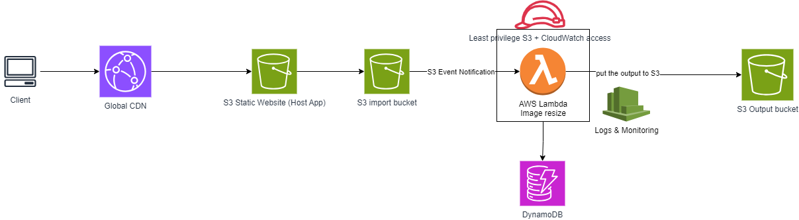

# Lambda-Architecture

🖼️ Serverless Image Processing Application 

A complete DevOps project that implements a serverless image processing application using AWS services, Terraform for IaC, and GitHub Actions for CI/CD.
The application automatically processes uploaded images by resizing them and adding watermarks.

## Architecture Diagram

This diagram shows the serverless image processing workflow using
Amazon S3, AWS Lambda, IAM, and CloudWatch.

---------------------------------------------------------------------------------------------------------------------
AWS Services Used

🪣 Amazon S3
- Stores original and processed images
- Triggers Lambda functions on upload
- Encryption + versioning enabled

⚡ AWS Lambda
- Resizes images (320px, 640px, 1024px)
- Adds watermarks
- Runs on Node.js 18.x runtime

🔐 AWS IAM
- Manages least-privilege permissions
- Grants Lambda access to S3

- 📊 Amazon CloudWatch
- Logs Lambda executions
- Provides monitoring & debugging

---------------------------------------------------------------------------------------------------------------------
⚙️ GitHub Actions Workflows:-
1- 🚀 Deploy Workflow

Trigger: Manual dispatch

Purpose: Deploy or update infrastructure

Steps: Checkout → AWS credentials → Node.js setup → Install Lambda deps → Terraform init → Plan → Apply

2- 💥 Destroy Workflow

Trigger: Manual dispatch

Purpose: Remove all deployed resources

Steps: Checkout → AWS credentials → Node.js setup → Terraform init → Destroy
---------------------------------------------------------------------------------------------------------------------
**🔑 Prerequisites
**
AWS account with required permissions

Terraform installed locally

GitHub account

Created an S3 bucket for Terraform state storage:
aws s3api create-bucket \
  --bucket rwayda0-terraform-tfstate-bucket \
  --region us-east-1

Enable versioning:

aws s3api put-bucket-versioning \
  --bucket rwayda0-terraform-tfstate-bucket \
  --versioning-configuration Status=Enabled

📌 Usage Instructions
Upload Images

Upload to: uploads/ folder in the original S3 bucket

Example:

my-original-images-rwayda36/uploads/sample.jpg

Retrieve Processed Images

Available in processed S3 bucket

Organized by size:

processed/imagename_320px.jpg

processed/imagename_640px.jpg

processed/imagename_1024px.jpg

Customize Processing

Update image_sizes in terraform.tfvars

Change watermark_text for custom watermark

---------------------------------------------------------------------------------------------------------------------
🛠️ Troubleshooting

Lambda Function Not Triggered
✅ Ensure upload goes to uploads/ folder
✅ Verify S3 event notifications

Lambda Function Errors
🔎 Check CloudWatch logs
🔎 Verify dependencies

Permission Errors
🔐 Confirm IAM roles & AWS credentials
